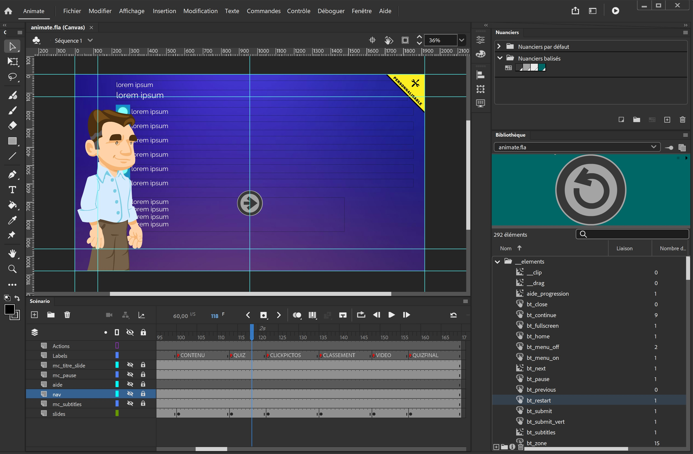
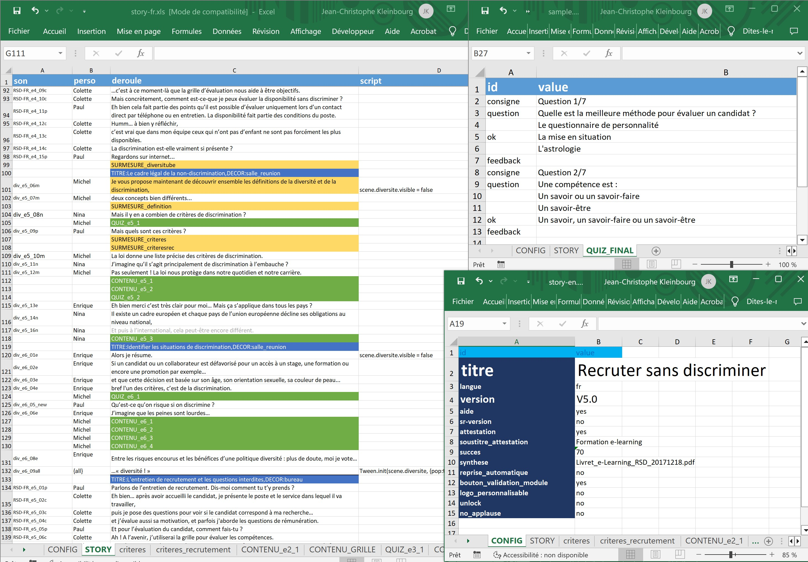

# E-LEARNING ENGINE ANIMATE JS

*Version 4.2 // 11/2023*

#  About

## A toolbox and ready-to-use template for creating interactive learning modules in full-front JS with **Adobe Animate**.

## Features:

- **BROWSER COMPATIBILITY FOR ANDROID/IOS/WEB** Responsive and full-screen modes, mobile detection

- **INTERACTIVITY: MULTIPLE-CHOICE QUIZZES, CLASSIFICATION, CLICK ELEMENTS, DRAG/DROP**, also custom interactive screens with external JS files and JSON content

- **AUTOMATED MODULE CONTENT** Through XLS parsing included in `./assets/data/MyStory.xls`

- **SCORM 1.2 / 2004 FOR LMS**, or standard web (automatic detection of connection mode)

- **VIDEO** intégration in mp4 format with the use of mediaelement.js library

- **'PACKAGED' JS LIBRARIES AND RESOURCES**: No CDNs or external resources; all JS libraries are statically copied for easy maintainability

- **RESOURCE PRELOADING**: All content (voiceovers/images) is preloaded at module launch

- **ERROR HANDLING**: In case of JS error, a PDF report is generated, and a modal prompts the user to download it

- **MULTI-LANGUAGE STORYBOARDS MANAGEMENT** with language selection at launch for the user

- **AUTO-GENERATED CERTIFICATES AND PDF** : Learners can download their final quiz reviews and school-branded certificate with their name, score, etc.

- **CUSTOMIZABLE**: Source code included in this repository for tool customization/extensibility

## JS Librairies included:
- **Dojo Toolkit 1.17.3**
- **Create JS 1.0**
- Bootstrap 3.3.7 + bootstrap3-dialog
- download.js
- fontawesome 4.7.0
- jquery 1.12.4
- jquery easing 1.3
- js.cookie 2.1.4
- jspdf 1.5.3
- mediaelement
- moment.js with locales
- pipwerks SCORM API
- pleaserotate.js
- scroll-container-plus.js
- sheetjs / xlsx.js
- shortcut.js

## Nota bene

The whole project had been developped in ECMAScript Edition 5 (ES5) for the use of Dojo toolkit, which use is mainly for the possibility of asynchrone modules.

That means nottably the use of `var` and DOM declared variables, and non-arrow `function fn(){}` syntax.

an update to recent ECMA SCRIPT would be useful for future developement, but not necessary at this time, the tool being optimized during the past years until today for the most recent browsers (Chrome / Safari).

## Usage for developement / mod:

- Clone the whole repository. All JS librairies are directly included (no installation).

- If you mod something in `app_src/`, then you need to recompile the source, a BASH file is ready to use, run it from your CLI :
`SOURCE/assets/app_src/COMPILE.BAT`

- For Linux / Mac users you can find .sh scripts as well in /dojo/utils/

- Launch with index.html or package .zip for LMS

**Packages and structure of modules:**

- `animator/` : related to Adobe Animate (tween objects, buttons, quizzes, drag-drop, ...)

- `engine/` : main modules (`Player.js` contains the methods for the UI, Launch and SCORM | `ChapitrePlayer.js` contains the methods that parse the storyboard into playable actions)

- `util/` : modules not related to Adobe Animate (JsonHandler, Bootstrap modals, timers, sound management, etc.)

- `pdf/` : for pdf generation (see module `EasyPDF.js`)

---

#  À propos

Base d'outils et template prêt à l'emploi pour la réalisation de modules d'apprentissage intéractifs avec **Adobe Animate**

### Fichier `Animate.fla` :

- personnalisation possible des éléments d'interface :

 

- Positionnement des décors et personnages / réglages des plans caméra pour le storyboard :

### Générateur Word vers Excel avec script VBA `STORYBOARD-XLS-DATA-MAKER/` pour la rédaction du contenu :

Un fichier EXCEL-IMPORTER.XLSM permet la transformation d'un scénario réalisé sous Word à un fichier DATA.XLS pouvant être lu par le programme (`./STORYBOARD-XLS-DATA-MAKER/CONSTRUCTION_WORD_IMPORTER.vba`)

 

### Personnalisation et modifications via classeur Excel `.assets/data/yourStory.xls` :

### Exécution dans navigateur / Environnement LMS (Moodle, etc.) :

---

# Mode d'emploi intégration

## CREATION DU SCENARIO Storyboard

1) Lancer `XLS_CONSTRUCTION/CONSTRUCTION WORD IMPORTER.xlsm` exécuter le script
---
2) Choisir le Word à transformer vers Excel
---
3) Dans le fichier XLS généré, effectuer les tâches suivantes :
- Passer tous les titres en `TITRE:......,DECOR:.....` pour définir les décors d'Animate voulus pour chaque chapitre
- S'assurer que la feuille du quiz final est bien appelée QUIZ_FINAL

*Note : Dans le prologue, la phrase qui commence par "retrouvons" est utilisé comme déclencheur pour afficher la vignette des personnages lorsque Marcillac présente.*

# Modifications possibles dans le XLS :

## FEUILLE STORY:

### colonne 'perso' :

Syntaxe	| Description
--- | ---
`perso{turn}` ou `perso{turnstay}`	|	tourne le personnage de l'autre côté au moment de la réplique soit 1 fois soit de manière permanente
`{all}`	|	synchro labiale du son sur tous les personnages de la scène (chorus)
`{none}`	|	aucune synchro labiale (exemple : bruitage)

### colonne 'deroule' :

Syntaxe	| Description
--- | ---
`CONTENU_xxxxxx` | Ecran de contenu ancrage + images
`QUIZ_xxxxxx` | Quiz QCM/QCU
`VIDEO_myvideo` | joue la vidéo assets/videos/myvideo.mp4 (format recommandé : 1280x640, .mp4 (h264), autour de 700kbs)
`DECOR:______` | permet de faire une transition de décor à l'intérieur d'un chapitre
`DECOR:______,FADE:true` | idem précédent mais avec effet de fondu au noir en apparition
`SURMESURE_xxxxxx` | exécute l'écran sur-mesure contenu dans le script `xxxxxx.js` dans `app/` (bien penser à mettre nom du label/clip dans le JS, cf commentaires dans fichiers d'exemples fournis dans ce pack)

### colonne 'script' :

Possibilité de rajouter du script JS dans la 4eme colonne de la feuille STORY. Ex.: `Tween.init(scene.pot_de_fleur, {pop:true})` - le mot clé 'scene' correspond au MovieClip de la scène en cours

## SYNTAXE DES FEUILLES 'QUIZ_xxx' :

Prendre un modèle existant et copier coller les questions (la ligne 'consigne' est facultative, et la ligne 'feedback' est quant à elle obligatoire (laisser vide si non utilisé).

La bonne réponse est indiquée par le mot "ok". Il est possible d'avoir une bonne réponse (QCU) ou bien plusieurs (QCM)
Notez qu'il est possible de forcer la possibilité de réponse multiple pour un QCU en utilisant "okm" à la place de "ok"

## SYNTAXE DES FEUILLES 'CONTENU_xxx' :

### colonne 'texte' :

Syntaxe			|	Description
--- | ---
`xxxxxxxxxx`		| 	< texte en taille normale
`GRAS:xxxxxxxxx`	|	< texte en gras
`SMALL:xxxxxxxxx`	|	< texte en plus petit
`-xxxxxxxxxxxxx`	|	< texte en plus petit avec bullet point
`espace`			|	< ligne d'espace (environ 2 lignes)

### colonne 'media' :

Syntaxe			|	Description 							
 ---- | ----
`IMG:xxxxx.png`	| 	< ajoute une image à gauche du texte (étendue en hauteur lorsque répété sur plusiers cases à la suite)
`IMGLINE:xxxxx.png`	|	< ajoute une image à gauche de la hauteur de la première ligne de texte
`IMGCORNER:xxxxx.png`	|	< ajoute une image en haut à droite de l'écran
`SON:xxxxxx.mp3`	|	< ajoute un son en synchro de la ligne (nécessite un personnage)

### Possibilité de faire de la SYNCHRO LIGNE PAR LIGNE avec un personnage (avec le contenu du dialogue depuis la feuille STORY) :

**Exemple :** `CONTENU_MONCONTENU, 4`	< Si le chiffre 4 est égal aux nombre de lignes de la feuille CONTENU correspondante, alors il y a synchronisation de l'apparition des textes avec les voix-off. A contrario si le contenu, les 4 lignes de dialogue sont lus à la suite une fois tous les élements de contenu affichés à l'écran.

> Notez qu'il est aussi possible de mettre des sons voix-off dans la colonne SON (cf tableau ci-dessus), mais ceux-ci n'affichent pas de sous-titres, car l'on considère qu'il reprennent la lecure audio du texte affiché.

# Finalisation / Export SCORM / Mise en ligne : 
## Enregistrer l'Excel dans assets/data/ et éditer `app/data/_ExcelName.js` pour y indiquer le nom de celui-ci :

### DEFINIR LE MULTI-LANGUE (OPTION) :
Dans le cas du multi-langue, plusieurs fichiers Excel doivent être dans le dossier data/ , chacun finissant par "-XX", (XX correspondant à la langue)

**Exemple de _ExcelName.js pour multilang fr + en :**

~~~
	var __ExcelName = "story.xls";
	var __Langs = ["en", "fr"];
~~~

(Les fichiers Excel correspondants seront dans ce cas : 'story-fr.xls' et 'story-en.xls')

**Dans le cas d'un module classique mono-langue, on aura :**

~~~~
	var __ExcelName = "story.xls";
	var __Langs = ["fr"];
~~~~

(Dans ce cas le module ne propose pas de choix de langue.)

### ÉDITER LA CONFIG POUR LA MISE EN PACK SCORM (si nécessaire)
Permet de régler la langue par défaut, le mode plein-écran, et la détection du scorm automatique

- `assets/app/CONFIG.js`

### S'ASSURER QUE L'INDEX.HTML EST EN MODE PROD
~~~~
!-- to modify for prod -->
<!--  -->
<!--  -->

~~~~

### PLACER LES FICHIERS SCORM À LA RACINE / PACKAGER .ZIP

/ Lancer `index.html` 

# Licence MIT

Droit d'auteur (c) [2023] [jck]

La présente autorise, gratuitement, toute personne obtenant une copie de ce logiciel et des fichiers de documentation associés (le "Logiciel"), à traiter le Logiciel sans restriction, notamment, sans limitation, les droits d'utiliser, de copier, de modifier, de fusionner, de publier, de distribuer, de sous-licencier et/ou de vendre des copies du Logiciel, et d'autoriser les personnes à qui le Logiciel est fourni de le faire, sous réserve des conditions suivantes :

Le présent avis de droit d'auteur et cet avis d'autorisation doivent être inclus dans toutes copies ou parties substantielles du Logiciel.

LE LOGICIEL EST FOURNI "TEL QUEL", SANS GARANTIE D'AUCUNE SORTE, EXPRESSE OU IMPLICITE, NOTAMMENT, MAIS SANS S'Y LIMITER, LES GARANTIES DE QUALITÉ MARCHANDE, D'ADÉQUATION À UN USAGE PARTICULIER ET D'ABSENCE DE CONTREFAÇON. EN AUCUN CAS, LES AUTEURS OU DÉTENTEURS DU DROIT D'AUTEUR NE SERONT RESPONSABLES DE TOUT RÉCLAMATION, DOMMAGE OU AUTRE RESPONSABILITÉ, QUE CE SOIT DANS UNE ACTION DE CONTRAT, DÉLIT OU AUTRE, DÉCOULANT DE, OU EN LIEN AVEC LE LOGICIEL OU L'UTILISATION, OU D'AUTRES TRAITEMENTS DANS LE LOGICIEL.
